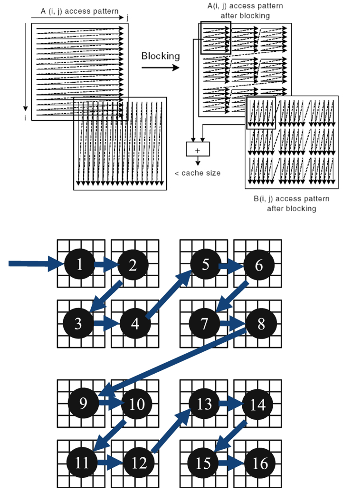

# 六、理解常用并行算法及其实现原理

> 学习自:
> 
> [【C++】transform, reduce, scan是什么意思？理解常用并行算法及其实现原理](https://www.bilibili.com/video/BV1gu411m7kN)
>
> 推荐阅读: 《Pro TBB》

## 第0章: 从并发到并行
### 0.1 摩尔定律: 停止增长了吗?


> 你醒啦？免费午餐结束了！
>
> 指望靠单核性能的增长带来程序性能提升的时代一去不复返了，现在要我们动动手为多核优化一下老的程序，才能搭上摩尔定律的顺风车。

- 晶体管的密度的确仍在指数增长，但处理器主频却开始停止增长了，甚至有所下降。

- 很长时间之前我们就可以达到2GHz（2001年8月），根据2003年的趋势，在2005年初我们就应该研发出10GHz的芯片。

- 可为何直到今天也生产不出10GHz的芯片？

结论: 狭义的摩尔定律没有失效。但晶体管数量的增加, **不再** 用于继续提升单核频率, 转而用于增加 **核心数量**。单核性能 **不再** 指数增长！

### 0.2 神话与现实：2 * 3GHz < 6GHz
一个由双核组成的3GHz的CPU实际上提供了6GHz的处理能力，是吗?

- 显然不是。甚至在两个处理器上同时运行两个线程也不见得可以获得两倍的性能。相似的，大多数多线程的应用不会比双核处理器的两倍快。他们应该比单核处理器运行的快，但是性能毕竟不是线性增长。

- 为什么无法做到呢？首先，为了保证缓存一致性以及其他握手协议需要运行时间开销。在今天，双核或者四核机器在多线程应用方面，其性能不见得的是单核机器的两倍或者四倍。这一问题一直伴随CPU发展至今。


### 0.3 并发和并行的区别

**并发**: 单核处理器，操作系统通过`时间片调度算法`，轮换着执行着不同的线程，看起来就好像是同时运行一样，其实每一时刻只有一个线程在运行。目的: 异步地处理多个不同的任务，避免同步造成的阻塞。

**并行**：多核处理器，每个处理器执行一个线程，真正的同时运行。目的: 将一个任务分派到多个核上，从而更快完成任务。


> 举例:
>
> 图形学爱好者：我看中的是多核，目的是加速比，如果是单核，那多线程对我无用！
>
> 某互联网公司：我看中的是异步，目的是无阻塞，即使是单核，多线程对我也有用。

### 0.4 英特尔开发的tbb的安装与食用
#### 0.4.1 安装

Ubuntu:
```sh
sudo apt-get install libtbb-dev
```

Arch Linux:
```sh
sudo pacman -S tbb
```

Windows:
```sh
.\vcpkg install tbb:x64-windows
```

Mac OS:
```sh
.\vcpkg install tbb:x64-macos
```

> [!TIP]
> 安装包管理器, Linux可以使用自带的, 如`pacman -S fmt`
>
> win需要搞`vcpkg`. 详见 https://www.bilibili.com/video/BV1fa411r7zp 的 1:18:48

#### 0.4.2 cmake链接

```CMake
project(03-tbb LANGUAGES CXX)

file(GLOB_RECURSE srcs CONFIGURE_DEPENDS 
    *.cpp 
    *.h
    *.hpp
)

# 编译可执行文件
add_executable(03-tbb ${srcs})

# 添加TBB依赖
find_package(TBB REQUIRED)
target_link_libraries(03-tbb TBB::tbb)
```

#### 0.4.3 基于标准库的实现

回顾[五、C++11开始的多线程编程](), 我们实现了:

```C++
#include <iostream>
#include <string>
#include <thread>

void download(std::string file) {
    for (int i = 0; i < 10; ++i) {
        std::cout << "Downloading " << file
                  << " (" << i * 10 << "%)..." << '\n';
        std::this_thread::sleep_for(std::chrono::milliseconds(400));
    }
    std::cout << "Download complete: " << file << '\n';
}

void interact() {
    std::string name;
    std::cin >> name;
    std::cout << "Hi, " << name << '\n';
}

int main() {
    std::thread t([&]{
        download("loli.zip");
    });
    interact();
    t.join();
    return 0;
}
```

同理, 在tbb中, 我们也可以复刻上面的功能

#### 0.4.4 tbb: 任务组

用一个任务组`tbb::task_group`启动多个任务，一个负责下载，一个负责和用户交互。并在主线程中等待该任务组里的任务全部执行完毕。

区别在于，一个任务 **不一定** 对应一个线程，如果任务数量超过CPU最大的线程数，会由 TBB 在用户层负责调度任务运行在多个预先分配好的线程，而 **不是** 由操作系统负责调度线程运行在多个物理核心。

```C++
#include <iostream>
#include <string>
#include <tbb/task_group.h>

void download(std::string file) {
    for (int i = 0; i < 10; ++i) {
        std::cout << "Downloading " << file
                  << " (" << i * 10 << "%)..." << '\n';
        std::this_thread::sleep_for(std::chrono::milliseconds(400));
    }
    std::cout << "Download complete: " << file << '\n';
}

void interact() {
    std::string name;
    std::cin >> name;
    std::cout << "Hi, " << name << '\n';
}

int main() {
    tbb::task_group tg;
    tg.run([]{
        download("loli.zip");
    });
    tg.run([]{
        interact();
    });
    // interact();
    tg.wait();
    return 0;
}
```

#### 0.4.5 parallel_invoke

封装好的`task_group`, 多个函数对象的并行执行.

```C++
template<typename... Fs>
void parallel_invoke(Fs&&... fs) {
    invoke_helper<std::tuple<>, Fs...>()(std::forward<Fs>(fs)...);
}
```

```C++
#include <tbb/parallel_invoke.h>

// ...

int main() {
    tbb::parallel_invoke([]{
        download("loli.zip");
    }, []{
        interact();
    });
    return 0;
}
```

更好的例子:

```C++
std::string str{"Hello Loli~"};
char c = 'L';
tbb::parallel_invoke([&]{
    for (uint32_t i = 0; i < str.size() / 2; ++i)
        if (c == str[i])
            std::cout << "find!" << '\n';
}, [&]{
    for (uint32_t i = str.size() / 2; i < str.size(); ++i)
        if (c == str[i])
            std::cout << "find!" << '\n';
});
```

## 第1章: 并行循环
### 1.1 时间复杂度（time-efficiency）与工作量复杂度（work-efficiency）
对于并行算法，复杂度的评估则要分为两种：
- 时间复杂度：程序所用的总时间（重点）
- 工作复杂度：程序所用的计算量（次要）

这两个指标都是越低越好。时间复杂度决定了快慢，工作复杂度决定了耗电量。

通常来说, $$工作复杂度 = 时间复杂度 \times 核心数量$$

> 1个核心工作一小时，4个核心工作一小时。时间复杂度一样，而后者工作复杂度更高。
>
> 1个核心工作一小时，4个核心工作1/4小时。工作复杂度一样，而后者时间复杂度更低。

并行的主要目的是 **降低时间复杂度**, 工作复杂度通常是不变的。甚至有牺牲工作复杂度换取时间复杂度的情形。

并行算法的复杂度取决于数据量 $n$，还取决于线程数量 $c$，比如 $O(\frac{n}{c})$。不过要注意如果线程数量超过了 CPU 核心数量，通常就无法再加速了，这就是为什么要买更多核的电脑。

也有一种说法，认为要用 $c$ 趋向于无穷时的时间复杂度来衡量，比如 $O(\frac{n}{c})$ 应该变成 $O(1)$。

### 1.2 映射 (map)
#### 1.2.1 朴素版本
```C++
#include <vector>
#include <cmath>

int main() {
    int n = 1 << 26;
    std::vector<float> arr(n);
    for (size_t i = 0; i < arr.size(); ++i) {
        arr[i] = std::sin(i);
    }
    return 0;
}
```


1个线程，独自处理8个元素的映射，花了8秒

用电量: 1 * 8 = 8度电

结论: 串行映射的时间复杂度为 $O(n)$, 工作复杂度为 $O(n)$, 其中 $n$ 是元素个数.

#### 1.2.2 并行映射

```C++
#include <vector>
#include <cmath>
#include <tbb/task_group.h>

int main() {
    size_t n = 1 << 26;
    std::vector<float> arr(n);
    tbb::task_group tg;
    size_t maxt = 32; // 分块个数
    for (size_t t = 0; t < maxt; ++t) {
        size_t begin = t * n / maxt, end = std::min(n, (t + 1) * n / maxt);
        tg.run([&, begin, end] {
            for (size_t i = begin; i < end; ++i) {
                arr[i] = std::sin(i);
            }
        });
    }
    tg.wait();
    return 0;
}
```

#### 1.2.3 封装好的: parallel_for

```C++
template<typename Range, typename Body>
    __TBB_requires(tbb_range<Range> && parallel_for_body<Body, Range>)
void parallel_for(const Range& range, const Body& body);
```

```C++
#include <vector>
#include <cmath>
#include <tbb/parallel_for.h>

int main() {
    size_t n = 1 << 26;
    std::vector<float> arr(n);
    tbb::parallel_for(tbb::blocked_range<size_t>{0, n},
    [&](tbb::blocked_range<size_t> r) {
        for (size_t i = r.begin(); i < r.end(); ++i) {
            arr[i] = std::sin(i);
        }
    });
    return 0;
}
```

#### 1.2.4 面向初学者的: parallel_for

```C++
template <typename Index, typename Function>
    __TBB_requires(parallel_for_index<Index> && parallel_for_function<Function, Index>)
void parallel_for(Index first, Index last, const Function& f);
```

可以直接指定范围, 但是因为`Function`是独立调用的, 因此会缺少编译器的优化(上例可以被编译器矢量化, 而本例不能).

```C++
tbb::parallel_for((size_t)0, (size_t)n, [&](size_t i) {
    arr[i] = std::sin(i);
});
```

#### 1.2.5 基于迭代器的: parallel_for_each

```C++
template<typename Iterator, typename Body>
    __TBB_requires(std::input_iterator<Iterator> && parallel_for_each_iterator_body<Body, Iterator>)
void parallel_for_each(Iterator first, Iterator last, const Body& body);
```

```C++
#include <tbb/parallel_for_each.h>

tbb::parallel_for_each(arr.begin(), arr.end(), [&](float& v) {
    v = 32.f;
});
```

#### 1.2.6 二维区间上的 for 循环: blocked_range2d

```C++
template<typename RowValue, typename ColValue = RowValue>
    __TBB_requires(blocked_range_value<RowValue> &&
                   blocked_range_value<ColValue>)
class blocked_range2d;
```

```C++
#include <vector>
#include <cmath>
#include <tbb/parallel_for.h>
#include <tbb/blocked_range2d.h>

int main() {
    size_t n = 1 << 13;
    std::vector<float> arr(n * n);
    tbb::parallel_for(tbb::blocked_range2d<size_t>(0, n, 0, n),
    [&](tbb::blocked_range2d<size_t> r) {
        for (size_t i = r.cols().begin(); i < r.cols().end(); ++i) {
            for (size_t j = r.rows().begin(); j < r.rows().end(); ++j) {
                arr[i * n + j] = std::sin(i) * std::sin(j);
            }
        }
    });
    return 0;
}
```

#### 1.2.7 三维区间上的 for 循环: blocked_range3d

```C++
template<typename PageValue, typename RowValue = PageValue, typename ColValue = RowValue>
    __TBB_requires(blocked_range_value<PageValue> &&
                   blocked_range_value<RowValue> &&
                   blocked_range_value<ColValue>)
class blocked_range3d;
```

```C++
#include <tbb/blocked_range3d.h>

n = 1000;
arr.resize(n * n * n);
HX::STL::utils::TickTock<> _{"map_blocked_range3d"};
tbb::parallel_for(tbb::blocked_range3d<size_t>(0, n, 0, n, 0, n),
[&](tbb::blocked_range3d<size_t> r) {
    for (size_t i = r.pages().begin(); i < r.pages().end(); ++i) {
        for (size_t j = r.cols().begin(); j < r.cols().end(); ++j) {
            for (size_t k = r.rows().begin(); k < r.rows().end(); ++k) {
                arr[(i * n + j) * n + k] = std::sin(i) * std::sin(j) * std::sin(k);
            }
        }
    }
});
```

#### 1.2.8 所有区间类型


## 第2章: 缩并与扫描
### 2.1 缩并 (reduce)
#### 2.1.1 朴素版本

```C++
#include <cmath>

#include <HXSTL/utils/TickTock.hpp>

int main() {
    size_t n = 1 << 26;
    float res = 0;
    for (size_t i = 0; i < n; ++i) {
        res += std::sin(i);
    }
    HX::print::println("res: ", res);
    return 0;
}
```

1个线程，依次处理8个元素的缩并，花了7秒

用电量: 1 * 7 = 7度电

总用时: 1 * 7 = 7秒


结论: 串行缩并的时间复杂度为 $O(n)$，工作复杂度为 $O(n)$，其中 $n$ 是元素个数

#### 2.1.2 并行缩并

```C++
#include <cmath>
#include <vector>
#include <tbb/task_group.h>

#include <HXSTL/utils/TickTock.hpp>

int main() {
    size_t n = 1 << 26;
    float res = 0;
    tbb::task_group tg;
    size_t maxt = 16;
    std::vector<float> arr(maxt);
    for (size_t t = 0; t < maxt; ++t) {
        size_t begin = t * n / maxt, end = std::min(n, (t + 1) * n / maxt);
        tg.run([&, begin, end, t] {
            float ans = 0;
            for (size_t i = begin; i < end; ++i) {
                ans += std::sin(i);
            }
            arr[t] = ans;
        });
    }
    tg.wait();
    for (auto v : arr)
        res += v;
    HX::print::println("res: ", res);
    return 0;
}
```


第一步、4个线程，每人处理2个元素的缩并，花了1秒

第二步、1个线程，独自处理4个元素的缩并，花了3秒

用电量: 4 * 1 + 1 * 3 = 7度电

总用时: 1 + 3 = 4秒

结论: 并行缩并的时间复杂度为 $O(\frac{n}{c}+c)$，工作复杂度为 $O(n)$，其中 $n$ 是元素个数

#### 2.1.3 改进的并行缩并 (GPU)


刚才那种方式对 c 比较大的情况不友好，最后一个串行的 for 还是会消耗很多时间。

因此可以用递归的模式，每次只使数据缩小一半，这样基本每次都可以看做并行的 for，只需 $\log_2n$ 次并行 for 即可完成缩并。

这种常用于核心数量很多，比如 GPU 上的缩并。

结论: 改进后的并行缩并的时间复杂度为 $O(\log{n})$，工作复杂度为 $O(n)$

#### 2.1.4 封装好的: parallel_reduce

```C++
template<typename Range, typename Value, typename RealBody, typename Reduction>
    __TBB_requires(tbb_range<Range> && parallel_reduce_function<RealBody, Range, Value> &&
                   parallel_reduce_combine<Reduction, Value>)
Value parallel_reduce(
    const Range& range,        // 范围
    const Value& identity,     // 缩并初始值 (同时代表缩并计算中的累积值类型)
    const RealBody& real_body, // 范围内缩并的操作函数, 函数签名见下
    const Reduction& reduction // 合并两个缩并结果
);

// RealBody 的函数签名
Value operator()(
    const Range& range, // 当前需要处理的范围
    Value sum           // 计算的累积值 (初始化为 identity)
);                      // 相当于在范围内对元素进行处理并累加结果

// Reduction 的函数签名
Value operator()(
    const Value& left,  // 左侧的累积值 (前一个分块的结果)
    const Value& right  // 当前分块的部分和
);                      // 该函数应该合并 right 到 left, 形成完整的缩并结果

// 值得注意的是, 函数签名可以不带返回值, 此时参数的 Value 需带引用, 直接修改左侧累积值.
```

```C++
#include <cmath>
#include <tbb/blocked_range.h>
#include <tbb/parallel_reduce.h>

#include <HXSTL/utils/TickTock.hpp>

int main() {
    size_t n = 1 << 26;
    float res;
    res = tbb::parallel_reduce(tbb::blocked_range<size_t>(0, n), (float)0,
    [&](tbb::blocked_range<size_t> r, float v) {
        for (size_t i = r.begin(); i < r.end(); ++i) {
            v += std::sin(i);
        }
        return v;
    }, [](float a, float b) {
        return a + b;
    });
    HX::print::println("res: ", res);
    return 0;
}
```

#### 2.1.5 保证每次运行结果一致: parallel_deterministic_reduce

```C++
res = tbb::parallel_deterministic_reduce(tbb::blocked_range<size_t>(0, n), (float)0,
[&](tbb::blocked_range<size_t> r, float v) {
    for (size_t i = r.begin(); i < r.end(); ++i) {
        v += std::sin(i);
    }
    return v;
}, [](float a, float b) {
    return a + b;
});
```
#### 2.1.6 并行缩并的额外好处: 能避免浮点误差

例如求平均值:

```C++
#include <cmath>
#include <vector>
#include <tbb/blocked_range.h>
#include <tbb/parallel_reduce.h>

#include <HXSTL/utils/TickTock.hpp>

int main() {
    // init
    size_t n = 1 << 26;
    std::vector<float> arr(n);
    for (size_t i = 0; i < n; ++i) {
        arr[i] = 10.f + std::sin(i);
    }

    float sum = 0;
    {
        HX::STL::utils::TickTock<> _{"朴素求平均值(浮点有误差)"};
        for (size_t i = 0; i < n; ++i) {
            sum += arr[i];
        }
    }
    HX::print::println("朴素求平均值(浮点有误差): ", sum / n);

    {
        HX::STL::utils::TickTock<> _{"并行缩并求平均值(浮点几乎无误差)"};
        sum = tbb::parallel_reduce(tbb::blocked_range<size_t>(0, n), (float)0,
        [&](tbb::blocked_range<size_t> r, float v) {
            for (size_t i = r.begin(); i < r.end(); ++i)
                v += arr[i];
            return v;
        }, [](float a, float b) {
            return a + b;
        });
    }
    HX::print::println("并行缩并求平均值(浮点几乎无误差): ", sum / n);
    return 0;
}
```

输出:

```C++
4
10
```

> [!TIP]
> 浮点大加小, 会出现精度损失!

### 2.2 扫描 (scan)
#### 2.2.1 朴素版本

```C++
#include <vector>
#include <cmath>

#include <HXSTL/utils/TickTock.hpp>

int main() {
    size_t n = 1 << 26;
    std::vector<float> arr(n);
    float res = 0;
    {
        HX::STL::utils::TickTock<> _{"scan_std"};
        for (size_t i = 0; i < n; ++i) {
            res += std::sin(i);
            arr[i] = res;
        }
    }
    HX::print::println("arr[n/2]: ", arr[n/2]);
    HX::print::println("res: ", res);
    return 0;
}
```


如图所示，扫描和缩并差不多，只不过他会把求和的 **中间结果存到数组** 里去

1个线程，依次处理8个元素的扫描，花了7秒

用电量: 1 * 7 = 7度电

总用时: 1 * 7 = 7秒

结论: 串行扫描的时间复杂度为 $O(n)$, 工作复杂度为 $O(n)$.

#### 2.2.2 并行扫描

```C++
#include <cmath>
#include <iostream>
#include <vector>
#include <tbb/task_group.h>

#include <HXSTL/utils/TickTock.hpp>

int main() {
    size_t n = 1 << 26;
    std::vector<float> arr(n);
    float res = 0;

    size_t maxt = 4;
    {
        HX::STL::utils::TickTock<> _{"scan_task_group"};
        tbb::task_group tg1;
        std::vector<float> tmp_res(maxt);
        for (size_t t = 0; t < maxt; t++) {
            size_t beg = t * n / maxt;
            size_t end = std::min(n, (t + 1) * n / maxt);
            tg1.run([&, t, beg, end] {
                float local_res = 0;
                for (size_t i = beg; i < end; i++) {
                    local_res += std::sin(i);
                }
                tmp_res[t] = local_res;
            });
        }
        tg1.wait();

        for (size_t t = 0; t < maxt; t++) {
            tmp_res[t] += res;
            res = tmp_res[t];
        }

        tbb::task_group tg2;
        for (size_t t = 1; t < maxt; t++) {
            size_t beg = t * n / maxt - 1;
            size_t end = std::min(n, (t + 1) * n / maxt) - 1;
            tg2.run([&, t, beg, end] {
                float local_res = tmp_res[t];
                for (size_t i = beg; i < end; i++) {
                    local_res += std::sin(i);
                    arr[i] = local_res;
                }
            });
        }
        tg2.wait();
    }

    HX::print::println("arr[n/2]: ", arr[n/2]);
    HX::print::println("res: ", res);
    return 0;
}
```


第一步、4个线程，每人处理2个元素的缩并，花了1秒

第二步、1个线程，独自处理3个元素的缩并，花了3秒

第三步、3个线程，每人处理2个元素的缩并，花了1秒

用电量: 4 * 1 + 1 * 3 + 3 * 1 = 10度电

总用时: 1 + 3 + 1 = 5秒

结论: 并行扫描的时间复杂度为 $O(\frac{n}{c}+c)$, 工作复杂度为 $O(n+c)$, 其中 $n$ 是元素个数.

> [!NOTE]
> 并行优化:
>
> 分块计算`tmp_res` $O(n/maxt)$
>
> 合并块前缀和 $O(maxt) ≈ O(1)$
>
> 前缀和补全(以`tmp_res[i - 1]`作为第`i`块的初始值, 分块计算前缀和) $O(n/maxt))$

#### 2.2.3 改进的并行扫描 (GPU)


- 第一步、4个线程，每个处理2个元素的扫描，花了1秒
- 第二步、4个线程，每个处理2个元素的扫描，花了1秒
- 第三步、4个线程，每个处理2个元素的扫描，花了1秒
- 用电量: 3 * 4 = 12度电
- 总用时: 1 * 3 = 3秒

结论: 改进后的并行扫描的时间复杂度为 $O(\log n)$，工作复杂度为 $O(n \log n)$。

可见，并行后虽然降低了时间复杂度，但是以提升工作复杂度为代价！

*更多细节，敬请期待GPU专题，我们会以CUDA为例详细探讨两全方案。*

#### 2.2.4 封装好了: parallel_scan

```C++
template<typename Range, typename Value, typename Scan, typename ReverseJoin>
    __TBB_requires(tbb_range<Range> && parallel_scan_function<Scan, Range, Value> &&
                   parallel_scan_combine<ReverseJoin, Value>)
Value parallel_scan(
    const Range& range,             // 范围
    const Value& identity,          // 初始值(默认值) (同时代表扫描计算中的累积值类型)
    const Scan& scan,               // 主要的前缀扫描函数, 函数签名见下
    const ReverseJoin& reverse_join // 合并两个扫描结果
);

// Scan 的函数签名
void operator()(
    const Range& range, // 当前需要处理的范围
    Value& sum,         // 计算的累积值
    bool is_final       // 如果 true, 则真正写入 sum; 如果 false, 只是计算累积值, 不修改原数据
);                      // 相当于上边的 [分块计算] 和 [前缀和补全]

// ReverseJoin 的函数签名
void operator()(
    Value& left,       // 左侧的累积值 (前一个分块的结果)
    const Value& right // 当前分块的部分和
);                     // 该函数应该 累加 right 到 left, 以便形成完整的前缀和

// 值得注意的是, 函数签名可以带返回值为 Value, 此时参数的 Value 将不带引用.
```

## 第3章: 性能测试
### 3.1 并行和串行的速度比较


### 3.2 如何评价


## 第4章: 任务域与嵌套
### 4.1 任务域
#### 4.1.1 任务域: task_arena

```C++
#include <vector>
#include <cmath>
#include <tbb/task_arena.h>
#include <tbb/parallel_for.h>

int main() {
    size_t n = 1 << 13;
    std::vector<float> arr(n);
    tbb::task_arena ta;
    ta.execute([&] {
        tbb::parallel_for((size_t)0, (size_t)n, [&](size_t i) {
            arr[i] = std::sin(i);
        });
    });
    return 0;
}
```

#### 4.1.2 任务域: 指定使用4个线程

```C++
#include <vector>
#include <cmath>
#include <tbb/task_arena.h>
#include <tbb/parallel_for.h>

int main() {
    size_t n = 1 << 13;
    std::vector<float> arr(n);
    tbb::task_arena ta(4);
    ta.execute([&] {
        tbb::parallel_for((size_t)0, (size_t)n, [&](size_t i) {
            arr[i] = std::sin(i);
        });
    });
    return 0;
}
```

### 4.2 嵌套
#### 4.2.1 嵌套 for 循环

```C++
#include <vector>
#include <cmath>
#include <tbb/parallel_for.h>

int main() {
    size_t n = 1 << 13;
    std::vector<float> arr(n * n);
    tbb::parallel_for((size_t)0, (size_t)n, [&](size_t i) {
        tbb::parallel_for((size_t)0, (size_t)n, [&](size_t j) {
            arr[i * n + j] = std::sin(i) * std::sin(j);
        });
    });
    return 0;
}
```

> 其执行的本质是:
>
> - 外层 i 任务创建内层 j 任务
> - 内层 j 任务会被不同的线程执行
> - 外层任务不会立即阻塞, 而是等待内层全部完成

> [!TIP]
> 但是, 大多数情况下`blocked_range2d`更好.

#### 4.2.2 嵌套 for 循环: 死锁问题

```C++
#include <vector>
#include <cmath>
#include <mutex>
#include <tbb/parallel_for.h>

int main() {
    size_t n = 1 << 13;
    std::vector<float> arr(n * n);
    std::mutex mtx;
    tbb::parallel_for((size_t)0, (size_t)n, [&](size_t i) {
        std::lock_guard _{mtx};
        tbb::parallel_for((size_t)0, (size_t)n, [&](size_t j) {
            arr[i * n + j] = std::sin(i) * std::sin(j);
        });
    });
    return 0;
}
```

##### 4.2.2.1 死锁问题的原因
- 因为 TBB 用了 **工作窃取法** 来分配任务: 当一个线程 t1 做完自己队列里全部的工作时，会从另一个工作中线程 t2 的队列里取出任务，以免 t1 闲置浪费时间。

- 因此内部 for 循环有可能“窃取”到另一个外部 for 循环的任务，从而导致 mutex 被 **重复上锁**。


##### 4.2.2.2 解决1: 用标准库的递归锁 std::recursive_mutex

只需要如下修改:
```C++
// std::mutex mtx; // 这个会死锁, 因为 tbb 是任务窃取的, 因此一个线程可能重复上锁!
std::recursive_mutex mtx;
```

##### 4.2.2.3 解决2: 创建另一个任务域, 这样不同域之间就不会窃取工作

```C++
#include <vector>
#include <cmath>
#include <mutex>
#include <tbb/parallel_for.h>
#include <tbb/task_arena.h>

int main() {
    size_t n = 1 << 13;
    std::vector<float> arr(n * n);
    std::mutex mtx;
    tbb::parallel_for((size_t)0, (size_t)n, [&](size_t i) {
        std::lock_guard _{mtx};
        tbb::task_arena ta;
        // 新开一个任务域, 不同域之间就不会窃取工作
        ta.execute([&] {
            tbb::parallel_for((size_t)0, (size_t)n, [&](size_t j) {
                arr[i * n + j] = std::sin(i) * std::sin(j);
            });
        });
    });
    return 0;
}
```

##### 4.2.2.4 解决3: 同一个任务域, 但用 isolate 隔离, 禁止其内部的工作被窃取 (推荐)

```C++
#include <vector>
#include <cmath>
#include <mutex>
#include <tbb/parallel_for.h>
#include <tbb/task_arena.h>

int main() {
    size_t n = 1 << 13;
    std::vector<float> arr(n * n);
    std::mutex mtx;
    tbb::parallel_for((size_t)0, (size_t)n, [&](size_t i) {
        std::lock_guard _{mtx};
        // 用 isolate 隔离, 禁止其内部的工作被窃取
        tbb::this_task_arena::isolate([&] {
            tbb::parallel_for((size_t)0, (size_t)n, [&](size_t j) {
                arr[i * n + j] = std::sin(i) * std::sin(j);
            });
        });
    });
    return 0;
}
```

## 第5章: 任务分配
### 5.1 并行: 如何均匀分配任务到每个线程?
对于并行计算，通常都是 CPU 有几个核心就开几个线程，因为我们只要同时执行就行了嘛。


比如`cornell box`这个例子里，我们把图片 **均匀等分** 为四块处理。然而发现4号线程所在的块，由于在犄角旮旯里光线反弹的次数多，算得比其他块的慢，而有的块却算得快。但是因为木桶原理，最后花的时间由最慢的那个线程决定，因此变成1分30秒了，多出来的30秒里1号和2号核心在闲置着，因为任务简单已经算完了，只有4号核心一个人在处理额外的光线。

### 5.2 解决1: 线程数量超过CPU核心数量, 让系统调度保证各个核心始终饱和
因此，最好不是按照图像大小均匀等分，而是按照工作量大小均匀等分。然而工作量大小我们没办法提前知道...怎么办?

- 最简单的办法：只需要让线程数量超过CPU核心数量，这时操作系统会自动启用时间片轮换调度，轮流执行每个线程。


比如这里分配了16个线程，但是只有4个处理器核心。那么就会先执行1,2,3,4号线程，一段时间后自动切换到5,6,7,8线程。当一个线程退出时候，系统就不会再调度到他上去了，从而保证每个核心始终有事可做。

### 5.3 解决2: 线程数量不变, 但是用一个队列分发和认领任务
但是线程数量太多会造成调度的`overhead`(切换开销)。

- 所以另一种解法是: 我们仍是分配4个线程，但还是把图像切分为16份，作为一个“任务”推送到全局队列里去。每个线程空闲时会不断地从那个队列里取出数据，即“认领任务”。然后执行，执行完毕后才去认领下一个任务，从而即使每个任务工作量不一也能自动适应。


```C++
struct Task {
  int x0, y0;
  int nx, ny;
};
std::queue<Task> q;
```

这种技术又称为`线程池(thread pool)`，避免了线程需要保存上下文的开销。但是需要我们管理一个任务队列，而且要是线程安全的队列。

### 5.4 解决3: 每个线程一个任务队列, 做完本职工作后可以认领其他线程的任务


### 5.5 解决4: 随机分配法 (通过哈希函数或线性函数)
然而队列的实现较复杂且需要同步机制，还是有一定的`overhead`，因此另一种神奇的解法是:

我们仍是分配4个线程，但还是把图像切分为16份。然后规定每一份按照 $x,y$ 轴坐标位置编号，比如 $(1,3)$ 等。


把 $(x,y)$ 那一份，分配给 $(x + y \times 3) \mod 4$ 号线程。这样总体来看每个线程分到的块的位置是随机的，从而由于`正太分布`数量越大方差越小的特点，每个线程分到的总工作量大概率是均匀的。

GPU 上称为网格跨步循环（grid-stride loop）。

### 5.6 tbb::static_partitioner

```C++
#include <tbb/blocked_range.h>
#include <tbb/parallel_for.h>

#include <HXSTL/utils/TickTock.hpp>

int main() {
    size_t n = 32;
    tbb::task_arena ta(4);
    /*
        创建了 4 个线程 4 个任务
        每个任务包含 8 个元素
    */
    ta.execute([&]{
        using namespace std::chrono;
        tbb::parallel_for(tbb::blocked_range<size_t>(0, n),
        [&](tbb::blocked_range<size_t> r) {
            HX::print::println("线程: ", tbb::this_task_arena::current_thread_index(), ", size: ", r.size());
            std::this_thread::sleep_for(400ms);
        }, tbb::static_partitioner{});
    });
    return 0;
}
```

输出:

```C++
线程: 0, size: 8
线程: 1, size: 8
线程: 2, size: 8
线程: 3, size: 8
```

---

tbb::static_partitioner, 可以指定区间的粒度:

```C++
tbb::task_arena ta(4);
/*
    创建了 2 个线程 2 个任务
    每个任务包含 16 个元素
*/
ta.execute([&]{
    using namespace std::chrono;
    tbb::parallel_for(tbb::blocked_range<size_t>(0, n, 16), // 指定区间的粒度
    [&](tbb::blocked_range<size_t> r) {
        HX::print::println("线程: ", tbb::this_task_arena::current_thread_index(), ", size: ", r.size());
        std::this_thread::sleep_for(400ms);
    }, tbb::static_partitioner{});
});
```

输出:

```C++
线程: 0, size: 16
线程: 2, size: 16
```

### 5.7 tbb::simple_partitioner

```C++
tbb::task_arena ta(4);
/*
    创建了 4 个线程 32 个任务
    每个任务包含 1 个元素
*/
HX::STL::utils::TickTock<> _{"简单 simple_partitioner"};
ta.execute([&]{
    using namespace std::chrono;
    tbb::parallel_for(tbb::blocked_range<size_t>(0, n),
    [&](tbb::blocked_range<size_t> r) {
        HX::print::println("线程: ", tbb::this_task_arena::current_thread_index(), ", size: ", r.size());
        std::this_thread::sleep_for(400ms);
    }, tbb::simple_partitioner{});
});
```

输出:

```C++
线程: 0, size: 1
线程: 1, size: 1
线程: 2, size: 1
线程: 3, size: 1
...
```

---

tbb::static_partitioner, 指定区间的粒度

```C++
tbb::task_arena ta(4);
/*
    创建了 4 个线程 8 个任务
    每个任务包含 4 个元素
*/
HX::STL::utils::TickTock<> _{"simple_partitioner: 指定区间的粒度"};
ta.execute([&]{
    using namespace std::chrono;
    tbb::parallel_for(tbb::blocked_range<size_t>(0, n, 4),
    [&](tbb::blocked_range<size_t> r) {
        HX::print::println("线程: ", tbb::this_task_arena::current_thread_index(), ", size: ", r.size());
        std::this_thread::sleep_for(400ms);
    }, tbb::simple_partitioner{});
});
```

| **特性** | `tbb::simple_partitioner` | `tbb::static_partitioner` |
|----------|-------------------------|-------------------------|
| **任务划分方式** | **递归拆分**（动态调整） | **静态划分**（固定分配） |
| **默认 `grainsize`** | **1**（然后继续拆分） | **`n / c`**（不再拆分） |
| **负载均衡性** | **好**（适合负载不均的任务） | **一般**（适合负载均匀的任务） |
| **适用于** | **任务大小不均的情况** | **任务大小均匀的情况** |

### 5.8 tbb::auto_partitioner (默认)
自动根据`lambda`中函数的执行时间判断采用何种分配方法。

```C++
tbb::task_arena ta(4);
HX::STL::utils::TickTock<> _{"auto_partitioner"};
ta.execute([&]{
    using namespace std::chrono;
    tbb::parallel_for(tbb::blocked_range<size_t>(0, n),
    [&](tbb::blocked_range<size_t> r) {
        HX::print::println("线程: ", tbb::this_task_arena::current_thread_index(), ", size: ", r.size());
        std::this_thread::sleep_for(400ms);
    }, tbb::auto_partitioner{}); // 不加参数时候, 也是使用 tbb::auto_partitioner{}
});
```
### 5.9 循环不均匀情况的比较

```C++
#include <tbb/blocked_range.h>
#include <tbb/parallel_for.h>

#include <HXSTL/utils/TickTock.hpp>

int main() {
    size_t n = 32;
    using namespace std::chrono;
    {
        tbb::task_arena ta(4);
        HX::STL::utils::TickTock<> _{"tbb::static_partitioner 用于循环体不均匀的情况效果不好"};
        ta.execute([&]{
            tbb::parallel_for(tbb::blocked_range<size_t>(0, n),
            [&](tbb::blocked_range<size_t> r) {
                HX::print::println("线程: ", tbb::this_task_arena::current_thread_index(), ", size: ", r.size());
                for (size_t i = r.begin(); i < r.end(); ++i) {
                    std::this_thread::sleep_for(i * 10ms); // 安装索引暂停不同的时间, 以模拟
                }
            }, tbb::static_partitioner{});
        });
    }
    {
        tbb::task_arena ta(4);
        HX::STL::utils::TickTock<> _{"tbb::simple_partitioner 用于循环体不均匀的情况效果很好"};
        ta.execute([&]{
            tbb::parallel_for(tbb::blocked_range<size_t>(0, n),
            [&](tbb::blocked_range<size_t> r) {
                HX::print::println("线程: ", tbb::this_task_arena::current_thread_index(), ", size: ", r.size());
                for (size_t i = r.begin(); i < r.end(); ++i) {
                    std::this_thread::sleep_for(i * 10ms);
                }
            }, tbb::simple_partitioner{});
        });
    }
    return 0;
}
```

### 5.10 tbb::affinity_partitioner 记录历史, 下次根据经验自动负载均衡

```C++
#include <tbb/blocked_range.h>
#include <tbb/parallel_for.h>

#include <HXSTL/utils/TickTock.hpp>

int main() {
    size_t n = 32;
    {
        tbb::task_arena ta(4);
        tbb::affinity_partitioner affinity;
        for (size_t t = 0; t < 10; ++t) {
            HX::STL::utils::TickTock<> _{"tbb::affinity_partitioner: " + std::to_string(t)};
            ta.execute([&]{
                tbb::parallel_for(tbb::blocked_range<size_t>(0, n),
                [&](tbb::blocked_range<size_t> r) {
                    for (size_t i = r.begin(); i < r.end(); ++i) {
                        for (volatile size_t j = 0; j < i * 1000; ++j)
                            ;
                    }
                }, affinity);
            });
        }
    }
    return 0;
}
```

输出:

```C++
"tbb::affinity_partitioner: 0": 0.825926 ms
"tbb::affinity_partitioner: 1": 0.082637 ms
"tbb::affinity_partitioner: 2": 0.067462 ms
"tbb::affinity_partitioner: 3": 0.070366 ms
"tbb::affinity_partitioner: 4": 0.067258 ms
"tbb::affinity_partitioner: 5": 0.064990 ms
"tbb::affinity_partitioner: 6": 0.064479 ms
"tbb::affinity_partitioner: 7": 0.091179 ms
"tbb::affinity_partitioner: 8": 0.065745 ms
"tbb::affinity_partitioner: 9": 0.064024 ms
```

### 5.11 颗粒度问题

```C++
#include <vector>
#include <cmath>
#include <tbb/blocked_range.h>
#include <tbb/parallel_for.h>

#include <HXSTL/utils/TickTock.hpp>

int main() {
    size_t n = 1 << 26;
    std::vector<float> arr(n);
    {
        tbb::task_arena ta(4);
        HX::STL::utils::TickTock<> _{"tbb::simple_partitioner: 粒度为 1 太细了, 效果不好"};
        ta.execute([&]{
            tbb::parallel_for(tbb::blocked_range<size_t>(0, n),
            [&](tbb::blocked_range<size_t> r) {
                for (size_t i = r.begin(); i < r.end(); ++i) {
                    arr[i] = std::sin(i);
                }
            }, tbb::simple_partitioner{});
        });
    }
    {
        tbb::task_arena ta(4);
        HX::STL::utils::TickTock<> _{"tbb::static_partitioner: 粒度为 n / 4, 效果好"};
        ta.execute([&]{
            tbb::parallel_for(tbb::blocked_range<size_t>(0, n),
            [&](tbb::blocked_range<size_t> r) {
                for (size_t i = r.begin(); i < r.end(); ++i) {
                    arr[i] = std::sin(i);
                }
            }, tbb::static_partitioner{});
        });
    }
    {
        tbb::task_arena ta(4);
        HX::STL::utils::TickTock<> _{"tbb::simple_partitioner: 粒度手动设为 n / 8, 效果稍微更好一点"};
        ta.execute([&]{
            int c = ta.max_concurrency();
            tbb::parallel_for(tbb::blocked_range<size_t>(0, n, n / (2 * c)),
            [&](tbb::blocked_range<size_t> r) {
                for (size_t i = r.begin(); i < r.end(); ++i) {
                    arr[i] = std::sin(i);
                }
            }, tbb::simple_partitioner{});
        });
    }
    {
        tbb::task_arena ta(4);
        HX::STL::utils::TickTock<> _{"tbb::auto_partitioner: 自动判断也不错"};
        ta.execute([&]{
            tbb::parallel_for(tbb::blocked_range<size_t>(0, n),
            [&](tbb::blocked_range<size_t> r) {
                for (size_t i = r.begin(); i < r.end(); ++i) {
                    arr[i] = std::sin(i);
                }
            }, tbb::auto_partitioner{});
        });
    }
    return 0;
}
```

输出:

```C++
"tbb::simple_partitioner: 粒度为 1 太细了, 效果不好": 9552.873758 ms
"tbb::static_partitioner: 粒度为 n / 4, 效果好": 368.714352 ms
"tbb::simple_partitioner: 粒度手动设为 n / 8, 效果稍微更好一点": 364.58692 ms
"tbb::auto_partitioner: 自动判断也不错": 353.735991 ms
```

似乎, 默认的就很不错? 但真的是这样吗?

$$異議あり！$$

### 5.12 例子: 矩阵转置

```C++
#include <vector>
#include <cmath>
#include <tbb/blocked_range2d.h>
#include <tbb/parallel_for.h>

#include <HXSTL/utils/TickTock.hpp>

int main() {
    size_t n = 1 << 14;
    std::vector<float> arr(n * n);
    std::vector<float> brr(n * n);
    {
        tbb::task_arena ta(4);
        HX::STL::utils::TickTock<> _{"tbb::auto_partitioner: 默认矩阵转置"};
        ta.execute([&]{
            tbb::parallel_for(tbb::blocked_range2d<size_t>(0, n, 0, n),
            [&](tbb::blocked_range2d<size_t> r) {
                for (size_t i = r.cols().begin(); i < r.cols().end(); ++i) {
                    for (size_t j = r.rows().begin(); j < r.rows().end(); ++j) {
                        brr[i * n + j] = arr[j * n + i];
                    }
                }
            }, tbb::auto_partitioner{});
        });
    }
    {
        tbb::task_arena ta(4);
        size_t grain = 16;
        HX::STL::utils::TickTock<> _{"tbb::auto_partitioner: 默认矩阵转置"};
        ta.execute([&]{
            tbb::parallel_for(tbb::blocked_range2d<size_t>(0, n, grain, 0, n, grain),
            [&](tbb::blocked_range2d<size_t> r) {
                for (size_t i = r.cols().begin(); i < r.cols().end(); ++i) {
                    for (size_t j = r.rows().begin(); j < r.rows().end(); ++j) {
                        brr[i * n + j] = arr[j * n + i];
                    }
                }
            }, tbb::simple_partitioner{});
        });
    }
    return 0;
}
```

输出:

```C++
"tbb::auto_partitioner: 默认矩阵转置": 775.852298 ms
"tbb::auto_partitioner: 默认矩阵转置": 146.007878 ms
```

使用合适的 grain 大小, simple_partitioner 比 auto_partitioner 快 5.171 倍!!!

**原因**:




- `tbb::simple_partitioner`能够按照给定的粒度大小（grain）将矩阵进行分块。块内部小区域按照常规的两层循环访问以便矢量化，块外部大区域则以类似 Z 字型的曲线遍历，这样能保证每次访问的数据在地址上比较靠近，并且都是最近访问过的，从而已经在缓存里可以直接读写，避免了从主内存读写的超高延迟。

*下次课会进一步深入探讨访存优化，详细剖析这个案例，敬请期待。*

## 第6章: 并发容器
### 6.1 std::vector 扩容时会移动元素

```C++
#include <vector>

#include <HXSTL/utils/TickTock.hpp>

int main() {
    size_t n = 1 << 10;
    std::vector<float> arr;
    std::vector<float*> ptrArr(n);
    for (size_t i = 0; i < n; ++i) {
        arr.push_back(0);
        ptrArr[i] = &arr.back();
    }
    for (size_t i = 0; i < n; ++i) {
        HX::print::print(ptrArr[i] == &arr[i], ' ');
    }
    return 0;
}
```

输出:

```C++
...false false true true...
```

`std::vector`内部存储了一个指针，指向一段容量`capacity`大于等于其`size`的内存。

众所周知, `push_back`会导致`size`加 1，但当他看到容量`capacity`等于当前`size`时，意识到无法再追加新数据。这时他会重新`malloc`一段更大的连续内存，使得`capacity`变成`size`的两倍，并且把旧的数据移动过去，然后继续追加数据。

这就导致前半段的元素的地址被改变，从而导致之前保存的指针和迭代器失效。

解决方案: reserve 预留足够的 capacity


```C++
std::vector<float> arr;
std::vector<float*> ptrArr(n);
arr.reserve(n);
for (size_t i = 0; i < n; ++i) {
    arr.push_back(0);
    ptrArr[i] = &arr.back();
}
for (size_t i = 0; i < n; ++i) {
    HX::print::print(ptrArr[i] == &arr[i], ' ');
}
```

### 6.2 不连续的 tbb::concurrent_vector
#### 6.2.1 扩容不需移动位のconcurrent_vector

```C++
#include <tbb/concurrent_vector.h>

#include <HXSTL/utils/TickTock.hpp>

int main() {
    size_t n = 1 << 10;
    tbb::concurrent_vector<float> arr;
    std::vector<float*> ptrArr(n);
    for (size_t i = 0; i < n; ++i) {
        ptrArr[i] = &*arr.push_back(0);
    }
    for (size_t i = 0; i < n; ++i) {
        HX::print::print(int(ptrArr[i] == &arr[i]), ' ');
    }
    return 0;
}
```

std::vector 造成指针失效的根本原因在于他必须保证内存是连续的，从而不得不在扩容时移动元素。

因此可以用`tbb::concurrent_vector`，他不保证元素在内存中是连续的。换来的优点是`push_back`进去的元素，扩容时不需要移动位置，从而指针和迭代器不会失效。

同时他的 push_back 会额外返回一个迭代器（iterator），指向刚刚插入的对象。

> [!TIP]
> `std::deque<T>`也不保证元素在内存中是连续的, 并且扩容时也不需要移动位置.
>
> 它和`tbb::concurrent_vector`不同的是, 它不是线程安全的!

#### 6.2.2 grow_by 一次性扩容一定大小

```C++
tbb::concurrent_vector<float> arr;
for (size_t i = 0; i < 10; ++i) {
    auto it = arr.grow_by(2);
    *it++ = 1;
    *it++ = 2;
}
HX::print::println(arr);
```

push_back 一次只能推入一个元素。

而`grow_by(n)`则可以一次扩充 n 个元素。他同样是返回一个迭代器（iterator），之后可以通过迭代器的`++`运算符依次访问连续的 n 个元素, `*`运算符访问当前指向的元素。

#### 6.2.3 可安全地被多线程并发访问

```C++
size_t n = 1 << 10;
tbb::concurrent_vector<float> arr;
tbb::parallel_for((size_t)0, (size_t)n, [&](size_t i) {
    auto it = arr.grow_by(2);
    *it++ = std::sin(i);
    *it++ = std::cos(i);
});
HX::print::println("size: ", arr.size()); // 2048
```

除了内存不连续、指针和迭代器不失效的特点, `tbb::concurrent_vector`还是一个多线程安全的容器，能够被多个线程同时并发地`grow_by`或`push_back`而不出错。

而`std::vector`只有只读的`.size()`和`[]`运算符是安全的，且不能和写入的`push_back`等一起用，否则需要用读写锁保护。

#### 6.2.4 不建议通过索引随机访问
因为`tbb::concurrent_vector`内存不连续的特点，通过索引访问，比通过迭代器访问的效率低一些。

因此 **不推荐** 像`arr[i]`这样通过索引随机访问其中的元素, `*(it + i)`这样需要迭代器跨步访问的也 **不推荐**。

最好的方式是用 begin() 和 end() 的迭代器区间，按顺序访问。

```C++
{
    HX::STL::utils::TickTock<> _{"索引访问"};
    for (size_t i = 0; i < arr.size(); ++i) {
        arr[i] = i;
    }
}
{
    HX::STL::utils::TickTock<> _{"迭代器 + i 访问"};
    for (size_t i = 0; i < arr.size(); ++i) {
        *(arr.begin() + i) = i;
    }
}
{
    HX::STL::utils::TickTock<> _{"迭代器 访问"};
    size_t i = 0;
    for (auto& v : arr) {
        v = i++;
    }
}
```

输出:

```C++
"索引访问": 0.463539 ms
"迭代器 + i 访问": 0.760686 ms
"迭代器 访问": 0.169324 ms
```

#### 6.2.5 parallel_for 也支持迭代器
冷知识: `tbb::blocked_range`的参数不一定是`size_t`，也可以是迭代器表示的区间。

这样 lambda 体内 r 的 begin 和 end 也会返回`tbb::concurrent_vector`的迭代器类型。

第一个`tbb::blocked_range`尖括号里的类型可以省略是因为 C++17 的 CTAD 特性。第二个则是用了`decltype`自动推导，也可以`(auto r)`，这里写具体类型仅为教学目的。

```C++
tbb::parallel_for(tbb::blocked_range(arr.begin(), arr.begin()),
[&](tbb::blocked_range<decltype(arr.begin())> r) {
    for (auto it = r.begin(); it != r.end(); ++it) {
        *it += 1.0f;
    }
});
HX::print::println(arr[1]);
```

### 6.3 TBB 中其他并发容器


## 第7章: 并行筛选
### 7.1 朴素版本

```C++
#include <vector>
#include <cmath>

#include <HXSTL/utils/TickTock.hpp>

int main() {
    size_t n = 1 << 27;
    std::vector<float> arr;
    {
        HX::STL::utils::TickTock<> _{"01-stl-filter"}; // 3220.22441 ms
        for (size_t i = 0; i < n; ++i) {
            if (float v = std::sin(i); v > 0) {
                arr.push_back(v);
            }
        }
    }
    return 0;
}
```

利用 vector 的 push_back 动态追加数据, 筛选出所有大于 0 的 sin(i) 值


### 7.2 并行筛选1 (错的)

```C++
#include <cmath>
#include <tbb/blocked_range.h>
#include <tbb/parallel_for.h>
#include <tbb/concurrent_vector.h>

#include <HXSTL/utils/TickTock.hpp>

int main() {
    size_t n = 1 << 27;
    tbb::concurrent_vector<float> arr;
    {
        HX::STL::utils::TickTock<> _{"02-tbb-filter-err"}; // 5558.529482 ms
        tbb::parallel_for(tbb::blocked_range<size_t>(0, n),
        [&](tbb::blocked_range<size_t> r) {
            for (size_t i = r.begin(); i < r.end(); ++i) {
                if (float v = std::sin(i); v > 0) {
                    arr.push_back(v);
                }
            }
        });
    }
    return 0;
}
```

利用多线程安全的 concurrent_vector 动态追加数据

基本没有加速(甚至减速)，我猜想 concurrent_vector 内部可能用了简单粗暴的互斥量，只保证了安全，并不保证高效

加速比: 0.57 倍


### 7.3 并行筛选2

```C++
#include <cmath>
#include <tbb/blocked_range.h>
#include <tbb/parallel_for.h>
#include <tbb/concurrent_vector.h>

#include <HXSTL/utils/TickTock.hpp>

int main() {
    size_t n = 1 << 27;
    tbb::concurrent_vector<float> arr;
    {
        HX::STL::utils::TickTock<> _{"03-tbb-filter-ok"}; // 258.629378 ms
        tbb::parallel_for(tbb::blocked_range<size_t>(0, n),
        [&](tbb::blocked_range<size_t> r) {
            std::vector<float> tmpArr;
            for (size_t i = r.begin(); i < r.end(); ++i) {
                if (float v = std::sin(i); v > 0) {
                    tmpArr.push_back(v);
                }
            }
            auto it = arr.grow_by(tmpArr.size());
            for (size_t i = 0; i < tmpArr.size(); ++i) {
                *it++ = tmpArr[i];
            }
        });
    }
    return 0;
}
```

先推到线程局部（thread-local）的 vector, 最后一次性推入到 concurrent_vector, 可以避免频繁在 concurrent_vector 上产生锁竞争

加速比: 12.93 倍


### 7.4 并行筛选3

```C++
#include <cmath>
#include <tbb/blocked_range.h>
#include <tbb/parallel_for.h>
#include <tbb/concurrent_vector.h>

#include <HXSTL/utils/TickTock.hpp>

int main() {
    size_t n = 1 << 27;
    tbb::concurrent_vector<float> arr;
    {
        HX::STL::utils::TickTock<> _{"04-tbb-filter-okk"}; // 239.35617 ms
        tbb::parallel_for(tbb::blocked_range<size_t>(0, n),
        [&](tbb::blocked_range<size_t> r) {
            std::vector<float> tmpArr;
            tmpArr.reserve(r.size());
            for (size_t i = r.begin(); i < r.end(); ++i) {
                if (float v = std::sin(i); v > 0) {
                    tmpArr.push_back(v);
                }
            }
            auto it = arr.grow_by(tmpArr.size());
            std::copy(tmpArr.begin(), tmpArr.end(), it);
        });
    }
    return 0;
}
```

线程局部的 vector 调用 reserve 预先分配一定内存, 避免 push_back 反复扩容时的分段式增长, 同时利用标准库的 std::copy 模板简化了代码

加速比: 13.47 倍


### 7.5 并行筛选4

```C++
#include <vector>
#include <mutex>
#include <cmath>
#include <tbb/blocked_range.h>
#include <tbb/parallel_for.h>

#include <HXSTL/utils/TickTock.hpp>

int main() {
    size_t n = 1 << 27;
    std::vector<float> arr;
    std::mutex mtx;
    {
        HX::STL::utils::TickTock<> _{"05_tbb_filter_std_mtx"}; // 368.361569 ms
        tbb::parallel_for(tbb::blocked_range<size_t>(0, n),
        [&](tbb::blocked_range<size_t> r) {
            std::vector<float> tmpArr;
            tmpArr.reserve(r.size());
            for (size_t i = r.begin(); i < r.end(); ++i) {
                if (float v = std::sin(i); v > 0) {
                    tmpArr.push_back(v);
                }
            }
            std::lock_guard _{mtx};
            std::copy(tmpArr.begin(), tmpArr.end(), std::back_inserter(arr));
        });
    }
    return 0;
}
```

如果需要筛选后的数据是连续的，即 arr 是个 std::vector，这时就需要用 mutex 锁定，避免数据竞争。

加速比: 8.75 倍


### 7.6 并行筛选5 (小彭老师推荐方案)

```C++
#include <vector>
#include <mutex>
#include <cmath>
#include <tbb/blocked_range.h>
#include <tbb/parallel_for.h>

#include <HXSTL/utils/TickTock.hpp>

int main() {
    size_t n = 1 << 27;
    std::vector<float> arr;
    arr.reserve(n / 2 * 3); // 预留空间
    std::mutex mtx;
    {
        HX::STL::utils::TickTock<> _{"06_tbb_filter_std_mtx_good"}; // 293.567346 ms
        tbb::parallel_for(tbb::blocked_range<size_t>(0, n),
        [&](tbb::blocked_range<size_t> r) {
            std::vector<float> tmpArr;
            tmpArr.reserve(r.size());
            for (size_t i = r.begin(); i < r.end(); ++i) {
                if (float v = std::sin(i); v > 0) {
                    tmpArr.push_back(v);
                }
            }
            std::lock_guard _{mtx};
            std::copy(tmpArr.begin(), tmpArr.end(), std::back_inserter(arr));
        });
    }
    return 0;
}
```

先对 a 预留一定的内存，避免频繁扩容影响性能。

加速比: 10.96 倍

### 7.7 并行筛选6

```C++
#include <vector>
#include <cmath>
#include <tbb/blocked_range.h>
#include <tbb/parallel_for.h>
#include <tbb/spin_mutex.h>

#include <HXSTL/utils/TickTock.hpp>

int main() {
    size_t n = 1 << 27;
    std::vector<float> arr;
    arr.reserve(n / 2 * 3); // 预留空间
    tbb::spin_mutex mtx;
    {
        HX::STL::utils::TickTock<> _{"07_tbb_filer_spin_mtx"}; // 239.953767 ms ~ 3091.164019 ms
        tbb::parallel_for(tbb::blocked_range<size_t>(0, n),
        [&](tbb::blocked_range<size_t> r) {
            std::vector<float> tmpArr;
            tmpArr.reserve(r.size());
            for (size_t i = r.begin(); i < r.end(); ++i) {
                if (float v = std::sin(i); v > 0) {
                    tmpArr.push_back(v);
                }
            }
            std::lock_guard _{mtx};
            std::copy(tmpArr.begin(), tmpArr.end(), std::back_inserter(arr));
        });
    }
    return 0;
}
```

使用 tbb::spin_mutex 替代 std::mutex。spin_mutex（基于硬件原子指令）会让 CPU 陷入循环等待，而不像 mutex（操作系统提供调度）会让线程进入休眠状态的等待。

若上锁的区域较小，可以用轻量级的 spin_mutex。若上锁的区域很大，则循环等待只会浪费 CPU 时间。这里锁的区域是 std::copy，比较大，所以 spin_mutex 效果不如 mutex 好。

加速比: 1.04 ~ 13.46 倍

> [!TIP]
> 还有 tbb::spin_rw_mutex 对标 std::shared_mutex

### 7.8 并行筛选7 pod

```C++
#include <vector>
#include <atomic>
#include <cmath>
#include <tbb/blocked_range.h>
#include <tbb/parallel_for.h>

#include <HXSTL/utils/TickTock.hpp>

template <class T>
struct pod {
private:
    T _t;

public:
    pod() {}

    pod(pod &&p) : _t(std::move(p._t)) {}

    pod(pod const &p) : _t(p._t) {}

    pod &operator=(pod &&p) {
        _t = std::move(p._t);
        return *this;
    }

    pod &operator=(pod const &p) {
        _t = p._t;
        return *this;
    }

    pod(T &&t) : _t(std::move(t)) {}

    pod(T const &t) : _t(t) {}

    pod &operator=(T &&t) {
        _t = std::move(t);
        return *this;
    }

    pod &operator=(T const &t) {
        _t = t;
        return *this;
    }

    operator T const &() const {
        return _t;
    }

    operator T &() {
        return _t;
    }

    T const &get() const {
        return _t;
    }

    T &get() {
        return _t;
    }

    template <class... Ts>
    pod &emplace(Ts &&...ts) {
        ::new (&_t) T(std::forward<Ts>(ts)...);
        return *this;
    }

    void destroy() {
        _t.~T();
    }
};

int main() {
    size_t n = 1 << 27;
    std::vector<pod<float>> arr;
    arr.reserve(n); // 预留空间
    std::atomic<size_t> arrSize = 0;
    {
        HX::STL::utils::TickTock<> _{"08_tbb_filter_pod"}; // 221.490339 ms
        tbb::parallel_for(tbb::blocked_range<size_t>(0, n),
        [&](tbb::blocked_range<size_t> r) {
            std::vector<pod<float>> tmpArr(r.size());
            size_t tmpArrSize = 0;
            for (size_t i = r.begin(); i < r.end(); ++i) {
                if (float v = std::sin(i); v > 0) {
                    tmpArr[tmpArrSize++] = v;
                }
            }
            size_t base = arrSize.fetch_add(tmpArrSize);
            for (size_t i = 0; i < tmpArrSize; ++i) {
                arr[base++] = tmpArr[i];
            }
        });
    }
    return 0;
}
```

彻底避免了互斥量，完全通过预先准备好的大小，配合 atomic 递增索引批量写入。同时用小彭老师拍脑袋想到的 pod 模板类，使得 vector 的 resize 不会零初始化其中的值。

加速比: 14.53 倍

### 7.9 并行筛选8 (不推荐)

```C++
#include <vector>
#include <cmath>
#include <tbb/blocked_range.h>
#include <tbb/parallel_reduce.h>

#include <HXSTL/utils/TickTock.hpp>

int main() {
    size_t n = 1 << 27;
    {
        HX::STL::utils::TickTock<> _{"09_tbb_filter_不推荐"}; // 1803.93155 ms
        tbb::parallel_reduce(tbb::blocked_range<size_t>(0, n), std::vector<float>{},
        [&](tbb::blocked_range<size_t> r, std::vector<float> local_arr) {
            local_arr.reserve(local_arr.size() + r.size());
            for (size_t i = r.begin(); i < r.end(); ++i) {
                if (float v = std::sin(i); v > 0) {
                    local_arr.push_back(v);
                }
            }
            return local_arr;
        }, [] (std::vector<float> a, std::vector<float> const& b) {
            std::copy(b.begin(), b.end(), std::back_inserter(a));
            return a;
        });
    }
    return 0;
}
```

而是用 std::vector 作为 parallel_reduce 的元素类型，通过合并得出最终结果，也是可以的。很直观，可惜加速效果不好。

加速比: 1.78 倍

### 7.10 并行筛选9 (用于GPU)

```C++
#include <vector>
#include <cmath>
#include <tbb/blocked_range.h>
#include <tbb/parallel_for.h>
#include <tbb/parallel_scan.h>
#include "pod.hpp"

#include <HXSTL/utils/TickTock.hpp>

int main() {
    size_t n = 1 << 27;
    std::vector<pod<float>> arr(n);
    std::vector<pod<size_t>> ind(n + 1);
    {
        HX::STL::utils::TickTock<> _{"10_tbb_filter_gpu"}; // 331.844234 ms
        tbb::parallel_for(tbb::blocked_range<size_t>(0, n),
        [&](tbb::blocked_range<size_t> r) {
            for (size_t i = r.begin(); i < r.end(); ++i) {
                arr[i] = std::sin(i);
            }
        });
        ind[0] = 0;
        tbb::parallel_scan(tbb::blocked_range<size_t>(0, n), (size_t)0,
        [&](tbb::blocked_range<size_t> r, size_t sum, auto is_final) {
            for (size_t i = r.begin(); i < r.end(); ++i) {
                sum += arr[i] > 0 ? 1 : 0;
                if (is_final) {
                    ind[i + 1] = sum;
                }
            }
            return sum;
        }, [](size_t x, size_t y) {
            return x + y;
        });
        std::vector<pod<float>> res(ind.back());
        tbb::parallel_for(tbb::blocked_range<size_t>(0, n),
        [&](tbb::blocked_range<size_t> r) {
            for (size_t i = r.begin(); i < r.end(); ++i) {
                if (arr[i] > 0) {
                    res[ind[i]] = arr[i];
                }
            }
        });
    }
    return 0;
}
```

线程粒度很细，核心数量很多的 GPU，往往没办法用 concurrent_vector 和 thread-local vector。或是你需要保证筛选前后顺序不变。这时要把筛选分为三步:

1. 算出每个元素需要往 vector 推送数据的数量（本例中只有 0 和 1 两种可能）

2. 对刚刚算出的数据进行并行扫描（scan），得出每个 i 要写入的索引。

3. 再次对每个元素并行 for 循环，根据刚刚生成写入的索引，依次写入数据。

加速比: 9.70 倍（考虑到这里 ind 只有 0 和 1，应该大有优化空间）


## 第8章: 分治与排序
### 8.1 分治
#### 8.1.1 朴素版本

以递归求斐波那契数列第n项为例

```C++
#include <HXSTL/utils/TickTock.hpp>

int fib(int n) {
    if (n < 2)
        return n;
    return fib(n - 1) + fib(n - 2);
}

int main() {
    {
        HX::STL::utils::TickTock<> _{"01_std_fib"}; // 166.963338 ms
        HX::print::println(fib(39));
    }
    return 0;
}
```

#### 8.1.2 朴素并行版本

```C++
#include <tbb/task_group.h>

#include <HXSTL/utils/TickTock.hpp>

int fib(int n) {
    if (n < 2)
        return n;
    int a, b;
    tbb::task_group tg;
    tg.run([&]{
        a = fib(n - 1);
    });
    tg.run([&]{
        b = fib(n - 2);
    });
    tg.wait();
    return a + b;
}

int main() {
    {
        HX::STL::utils::TickTock<> _{"02_tbb_task_fib"}; // 1617.252967 ms
        HX::print::println(fib(39));
    }
    return 0;
}
```

#### 8.1.3 并行: 使用parallel_invoke

> [!NOTE]
> tbb::task_group 的封装: tbb::parallel_invoke

```C++
#include <tbb/parallel_invoke.h>

#include <HXSTL/utils/TickTock.hpp>

int fib(int n) {
    if (n < 2)
        return n;
    int a, b;
    tbb::parallel_invoke([&]{
        a = fib(n - 1);
    }, [&]{
        b = fib(n - 2);
    });
    return a + b;
}

int main() {
    {
        HX::STL::utils::TickTock<> _{"03_tbb_parallel_invoke_fib"}; // 1030.86636 ms
        HX::print::println(fib(39));
    }
    return 0;
}
```

#### 8.1.4 任务划分得够细时, 转为串行

任务划分得够细时，转为串行，缓解调度负担（scheduling overhead）


```C++
#include <tbb/parallel_invoke.h>

#include <HXSTL/utils/TickTock.hpp>

int serial_fib(int n) {
    return n < 2 ? n : serial_fib(n - 1) + serial_fib(n - 2);
}

int fib(int n) {
    if (n < 29)
        return serial_fib(n);
    int a, b;
    tbb::parallel_invoke([&]{
        a = fib(n - 1);
    }, [&]{
        b = fib(n - 2);
    });
    return a + b;
}

int main() {
    {
        HX::STL::utils::TickTock<> _{"04_tbb_scheduling_overhead_fib"}; // 15.479511 ms
        HX::print::println(fib(39));
    }
    return 0;
}
```

### 8.2 排序
#### 8.2.1 标准库的排序

```C++
#include <algorithm>
#include <vector>

#include <HXSTL/utils/TickTock.hpp>

int main() {
    size_t n = 1 << 22;
    std::vector<int> arr(n);
    std::generate(arr.begin(), arr.end(), std::rand);
    {
        HX::STL::utils::TickTock<> _{"01_std_sort"}; // 516.089914 ms
        std::sort(arr.begin(), arr.end(), std::less<>{});
    }
    return 0;
}
```

#### 8.2.2 手写的基于std::hash的快排

std::hash 用于从输入生成随机数，输入不变则结果不变。

随机枢轴的位置防止数据已经有序造成最坏的 $O(n^2)$。

```C++
#include <iostream>
#include <cstdlib>
#include <vector>
#include <cmath>
#include <algorithm>
#include "ticktock.h"

template <class T>
void quick_sort(T *data, size_t size) {
    if (size < 1)
        return;
    size_t mid = std::hash<size_t>{}(size);
    mid ^= std::hash<void *>{}(static_cast<void *>(data));
    mid %= size;
    std::swap(data[0], data[mid]);
    T pivot = data[0];
    size_t left = 0, right = size - 1;
    while (left < right) {
        while (left < right && !(data[right] < pivot))
            right--;
        if (left < right)
            data[left++] = data[right];
        while (left < right && data[left] < pivot)
            left++;
        if (left < right)
            data[right--] = data[left];
    }
    data[left] = pivot;
    quick_sort(data, left);
    quick_sort(data + left + 1, size - left - 1);
}

int main() {
    size_t n = 1<<24;
    std::vector<int> arr(n);
    std::generate(arr.begin(), arr.end(), std::rand);
    TICK(quick_sort);
    quick_sort(arr.data(), arr.size());
    TOCK(quick_sort);
    return 0;
}
```

#### 8.2.3 并行快速排序

```C++
#include <iostream>
#include <cstdlib>
#include <vector>
#include <cmath>
#include <algorithm>
#include <tbb/parallel_invoke.h>
#include "ticktock.h"

template <class T>
void quick_sort(T *data, size_t size) {
    if (size < 1)
        return;
    size_t mid = std::hash<size_t>{}(size);
    mid ^= std::hash<void *>{}(static_cast<void *>(data));
    mid %= size;
    std::swap(data[0], data[mid]);
    T pivot = data[0];
    size_t left = 0, right = size - 1;
    while (left < right) {
        while (left < right && !(data[right] < pivot))
            right--;
        if (left < right)
            data[left++] = data[right];
        while (left < right && data[left] < pivot)
            left++;
        if (left < right)
            data[right--] = data[left];
    }
    data[left] = pivot;
    tbb::parallel_invoke([&] {
        quick_sort(data, left);
    }, [&] {
        quick_sort(data + left + 1, size - left - 1);
    });
}

int main() {
    size_t n = 1<<24;
    std::vector<int> arr(n);
    std::generate(arr.begin(), arr.end(), std::rand);
    TICK(parallel_sort);
    quick_sort(arr.data(), arr.size());
    TOCK(parallel_sort);
    return 0;
}
```
加速比: 2.05 倍

#### 8.2.4 改进: 数据足够小时, 开始用标准库串行的排序

```C++
#include <iostream>
#include <cstdlib>
#include <vector>
#include <cmath>
#include <algorithm>
#include <tbb/parallel_invoke.h>
#include "ticktock.h"

template <class T>
void quick_sort(T *data, size_t size) {
    if (size < 1)
        return;
    if (size < (1<<16)) {
        std::sort(data, data + size, std::less<T>{});
        return;
    }
    size_t mid = std::hash<size_t>{}(size);
    mid ^= std::hash<void *>{}(static_cast<void *>(data));
    mid %= size;
    std::swap(data[0], data[mid]);
    T pivot = data[0];
    size_t left = 0, right = size - 1;
    while (left < right) {
        while (left < right && !(data[right] < pivot))
            right--;
        if (left < right)
            data[left++] = data[right];
        while (left < right && data[left] < pivot)
            left++;
        if (left < right)
            data[right--] = data[left];
    }
    data[left] = pivot;
    tbb::parallel_invoke([&] {
        quick_sort(data, left);
    }, [&] {
        quick_sort(data + left + 1, size - left - 1);
    });
}

int main() {
    size_t n = 1<<24;
    std::vector<int> arr(n);
    std::generate(arr.begin(), arr.end(), std::rand);
    TICK(better_parallel_sort);
    quick_sort(arr.data(), arr.size());
    TOCK(better_parallel_sort);
    return 0;
}
```

（和标准库串行的 std::sort）加速比：4.59 倍

#### 8.2.5 封装好了: tbb::parallel_sort

```C++
#include <vector>
#include <tbb/parallel_sort.h>

#include <HXSTL/utils/TickTock.hpp>

int main() {
    size_t n = 1 << 22;
    std::vector<int> arr(n);
    std::generate(arr.begin(), arr.end(), std::rand);
    {
        HX::STL::utils::TickTock<> _{"02_tbb_sort"}; // 80.744745 ms
        tbb::parallel_sort(arr.begin(), arr.end(), std::less<>{});
    }
    return 0;
}
```

加速比: 6.39 倍

### 8.3 重新认识改进的并行缩并
其实之前提到“改进后的并行缩并”，也是一种分治法的思想: **大问题一分为二变成小问题**，分派到各个CPU核心上，问题足够小时直接串行求解。

他也可以通过 parallel_invoke 分治来实现:

```C++
#include <cstdlib>
#include <vector>
#include <cmath>
#include <algorithm>
#include <numeric>
#include <tbb/parallel_invoke.h>

#include <HXSTL/utils/TickTock.hpp>

template <class T>
T quick_reduce(T *data, size_t size) {
    if (size < (1<<16)) {
        return std::reduce(data, data + size);
    }
    T sum1, sum2;
    size_t mid = size / 2;
    tbb::parallel_invoke([&] {
        sum1 = quick_reduce(data, mid);
    }, [&] {
        sum2 = quick_reduce(data + mid, size - mid);
    });
    return sum1 + sum2;
}

int main() {
    size_t n = 1<<25;
    std::vector<int> arr(n);
    int sum;
    std::generate(arr.begin(), arr.end(), std::rand);
    {
        HX::STL::utils::TickTock<> _{"03_tbb_divide_reduce"};
        sum = quick_reduce(arr.data(), arr.size());
    }
    printf("%d\n", sum);
    return 0;
}
```

## 第9章: 流水线并行
### 9.1 案例: 批量处理数据

注意到这里的`for (auto &dat: dats)`是可以并行的，试试看用`tbb::parallel_for_each`替代?

```C++
#include <vector>
#include <cmath>

#include <HXSTL/utils/TickTock.hpp>

struct Data {
    std::vector<float> arr;

    Data() {
        arr.resize(std::rand() % 100 * 500 + 10000);
        for (size_t i = 0; i < arr.size(); i++) {
            arr[i] = std::rand() * (1.f / (float)RAND_MAX);
        }
    }

    void step1() {
        for (size_t i = 0; i < arr.size(); i++) {
            arr[i] += 3.14f;
        }
    }

    void step2() {
        std::vector<float> tmp(arr.size());
        for (size_t i = 1; i < arr.size() - 1; i++) {
            tmp[i] = arr[i - 1] + arr[i] + arr[i + 1];
        }
        std::swap(tmp, arr);
    }

    void step3() {
        for (size_t i = 0; i < arr.size(); i++) {
            arr[i] = std::sqrt(std::abs(arr[i]));
        }
    }

    void step4() {
        std::vector<float> tmp(arr.size());
        for (size_t i = 1; i < arr.size() - 1; i++) {
            tmp[i] = arr[i - 1] - 2 * arr[i] + arr[i + 1];
        }
        std::swap(tmp, arr);
    }
};

int main() {
    size_t n = 1 << 12;
    std::vector<Data> dats(n);
    {
        HX::STL::utils::TickTock<> _{"01_std_for"}; // 548.912026 ms
        for (auto &dat: dats) {
            dat.step1();
            dat.step2();
            dat.step3();
            dat.step4();
        }
    }
    return 0;
}
```

### 9.2 简单粗暴并行 for

```C++
#include <vector>
#include <cmath>
#include <tbb/parallel_for_each.h>

#include <HXSTL/utils/TickTock.hpp>

struct Data {
    std::vector<float> arr;

    Data() {
        arr.resize(std::rand() % 100 * 500 + 10000);
        for (size_t i = 0; i < arr.size(); i++) {
            arr[i] = std::rand() * (1.f / (float)RAND_MAX);
        }
    }

    void step1() {
        for (size_t i = 0; i < arr.size(); i++) {
            arr[i] += 3.14f;
        }
    }

    void step2() {
        std::vector<float> tmp(arr.size());
        for (size_t i = 1; i < arr.size() - 1; i++) {
            tmp[i] = arr[i - 1] + arr[i] + arr[i + 1];
        }
        std::swap(tmp, arr);
    }

    void step3() {
        for (size_t i = 0; i < arr.size(); i++) {
            arr[i] = std::sqrt(std::abs(arr[i]));
        }
    }

    void step4() {
        std::vector<float> tmp(arr.size());
        for (size_t i = 1; i < arr.size() - 1; i++) {
            tmp[i] = arr[i - 1] - 2 * arr[i] + arr[i + 1];
        }
        std::swap(tmp, arr);
    }
};

int main() {
    size_t n = 1 << 12;
    std::vector<Data> dats(n);
    {
        HX::STL::utils::TickTock<> _{"02_tbb_for"}; // 240.428032 ms
        tbb::parallel_for_each(dats.begin(), dats.end(), [&](Data& dat) {
            dat.step1();
            dat.step2();
            dat.step3();
            dat.step4();
        });
    }
    return 0;
}
```

加速比: 2.28 倍

很不理想，为什么？

很简单，循环体太大，每跑一遍指令缓存和数据缓存都会重新失效一遍。且每个核心都在读写不同地方的数据，不能很好的利用三级缓存，导致内存成为瓶颈。


### 9.3 拆分为四个 for

```C++
#include <vector>
#include <cmath>
#include <tbb/parallel_for_each.h>

#include <HXSTL/utils/TickTock.hpp>

struct Data {
    std::vector<float> arr;

    Data() {
        arr.resize(std::rand() % 100 * 500 + 10000);
        for (size_t i = 0; i < arr.size(); i++) {
            arr[i] = std::rand() * (1.f / (float)RAND_MAX);
        }
    }

    void step1() {
        for (size_t i = 0; i < arr.size(); i++) {
            arr[i] += 3.14f;
        }
    }

    void step2() {
        std::vector<float> tmp(arr.size());
        for (size_t i = 1; i < arr.size() - 1; i++) {
            tmp[i] = arr[i - 1] + arr[i] + arr[i + 1];
        }
        std::swap(tmp, arr);
    }

    void step3() {
        for (size_t i = 0; i < arr.size(); i++) {
            arr[i] = std::sqrt(std::abs(arr[i]));
        }
    }

    void step4() {
        std::vector<float> tmp(arr.size());
        for (size_t i = 1; i < arr.size() - 1; i++) {
            tmp[i] = arr[i - 1] - 2 * arr[i] + arr[i + 1];
        }
        std::swap(tmp, arr);
    }
};

int main() {
    size_t n = 1 << 12;
    std::vector<Data> dats(n);
    {
        HX::STL::utils::TickTock<> _{"03_tbb_4for"}; // 274.305111 ms
        tbb::parallel_for_each(dats.begin(), dats.end(), [&](Data& dat) {
            dat.step1();
        });
        tbb::parallel_for_each(dats.begin(), dats.end(), [&](Data& dat) {
            dat.step2();
        });
        tbb::parallel_for_each(dats.begin(), dats.end(), [&](Data& dat) {
            dat.step3();
        });
        tbb::parallel_for_each(dats.begin(), dats.end(), [&](Data& dat) {
            dat.step4();
        });
    }
    return 0;
}
```

加速比: 2.00 倍

解决了指令缓存失效问题，但是4次独立的for循环每次结束都需要同步，一定程度上妨碍了CPU发挥性能；而且每个step后依然写回了数组，数据缓存没法充分利用。


### 9.4 另辟蹊径: 流水线并行

```C++
#include <vector>
#include <cmath>
#include <tbb/parallel_pipeline.h>

#include <HXSTL/utils/TickTock.hpp>

struct Data {
    std::vector<float> arr;

    Data() {
        arr.resize(std::rand() % 100 * 500 + 10000);
        for (size_t i = 0; i < arr.size(); i++) {
            arr[i] = std::rand() * (1.f / (float)RAND_MAX);
        }
    }

    void step1() {
        for (size_t i = 0; i < arr.size(); i++) {
            arr[i] += 3.14f;
        }
    }

    void step2() {
        std::vector<float> tmp(arr.size());
        for (size_t i = 1; i < arr.size() - 1; i++) {
            tmp[i] = arr[i - 1] + arr[i] + arr[i + 1];
        }
        std::swap(tmp, arr);
    }

    void step3() {
        for (size_t i = 0; i < arr.size(); i++) {
            arr[i] = std::sqrt(std::abs(arr[i]));
        }
    }

    void step4() {
        std::vector<float> tmp(arr.size());
        for (size_t i = 1; i < arr.size() - 1; i++) {
            tmp[i] = arr[i - 1] - 2 * arr[i] + arr[i + 1];
        }
        std::swap(tmp, arr);
    }
};

int main() {
    size_t n = 1 << 12;
    std::vector<Data> dats(n);
    {
        HX::STL::utils::TickTock<> _{"04_tbb_pipeline"}; // 01.18595 ms
        auto it = dats.begin();
        tbb::parallel_pipeline(8, tbb::make_filter<void, Data*>(tbb::filter_mode::serial_in_order, 
        [&](tbb::flow_control& fc) -> Data* {
            if (it == dats.end()) {
                fc.stop();
                return nullptr;
            }
            return &*it++;
        }), tbb::make_filter<Data*, Data*>(tbb::filter_mode::parallel,
        [&](Data* dat) {
            dat->step1();
            return dat;
        }), tbb::make_filter<Data*, Data*>(tbb::filter_mode::parallel,
        [&](Data* dat) {
            dat->step2();
            return dat;
        }), tbb::make_filter<Data*, Data*>(tbb::filter_mode::parallel,
        [&](Data* dat) {
            dat->step3();
            return dat;
        }), tbb::make_filter<Data*, void>(tbb::filter_mode::parallel,
        [&](Data* dat) {
            dat->step4();
        }));
    }
    return 0;
}
```

加速比：6.73 倍

反直觉的并行方式，但是加速效果却很理想，为什么？

流水线模式下每个线程都只做自己的那个步骤（filter），从而对指令缓存更友好。且一个核心处理完的数据很快会被另一个核心用上，对三级缓存比较友好，也节省内存。


且 TBB 的流水线，其实比教科书上描述的传统流水线并行更加优化:

他在 t1 线程算完 d1 的 s1 时，会继续让 t1 负责算 d1 的 s2，这样 d1 的数据就是在二级缓存里，比调度到让 t2 算需要进入三级缓存更高效。而当 t2 的队列比较空时，又会让 t1 继续算 d2 的 s2，这样可以避免 t2 闲置浪费时间。总之就是会自动负载均衡非常智能，完全无需操心内部细节。

### 9.5 流水线并行: filter 参数
- `serial_in_order`: 表示当前步骤只允许串行执行，且执行的顺序必须一致。

- `serial_out_of_order`: 表示只允许串行执行，但是顺序可以打乱。

- `parallel`: 表示可以并行执行当前步骤，且顺序可以打乱。

每一个步骤（filter）的输入和返回类型都可以不一样。

**要求**: 流水线上一步的返回类型，必须和下一步的输入类型一致。且第一步的没有输入，最后一步没有返回，所以都为`void`。

TBB 支持嵌套的并行，因此流水线内部也可以调用`tbb::parallel_for`进一步并行。

### 9.6 流水线的利弊
流水线式的并行，因为每个线程执行的指令之间往往没有关系，主要适用于各个核心可以独立工作的 CPU，GPU 上则有 stream 作为替代。

流水线额外的好处是可以指定一部分 filter 为串行的（如果他们没办法并行调用的话）而其他 filter 可以和他同时并行运行。这可以应对一些不方便并行，或者执行前后的数据有依赖，但是可以拆分成多个步骤（filter）的复杂业务。

还有好处是他无需先把数据全读到一个内存数组里，可以**流式处理数据（on-fly）**，节省内存。

不过需要注意流水线每个步骤（filter）里的工作量最好足够大，否则无法掩盖调度overhead。


## 总结: 各种并行模式
- 从串行到并行，从来就没有什么万能膏药。

- CPU上的并行尚且如此，何况GPU。

- 熟悉原理、反复实验，才能优化出好程序。

- 本课仅入门，深入可以看 Pro TBB 这本书。

- 优化重点在于程序的瓶颈部分，不用在小细节上浪费精力。如果有个 O(n²) 的循环体，则只看他，并无视一旁的 O(n) 循环体。


